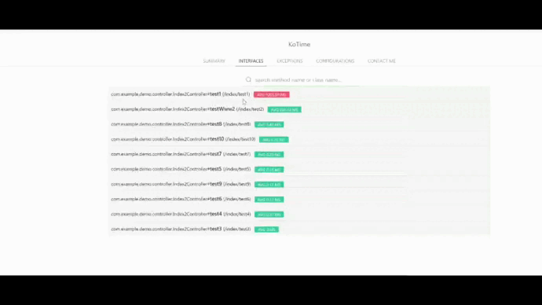
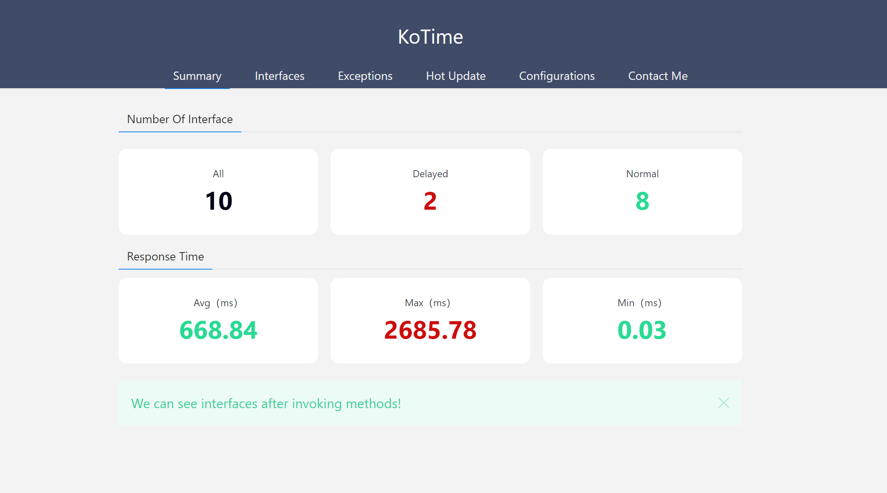
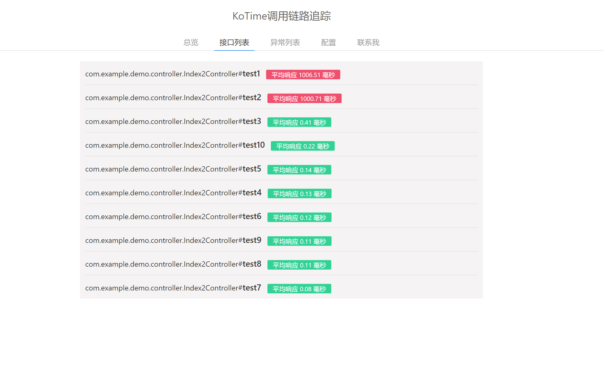
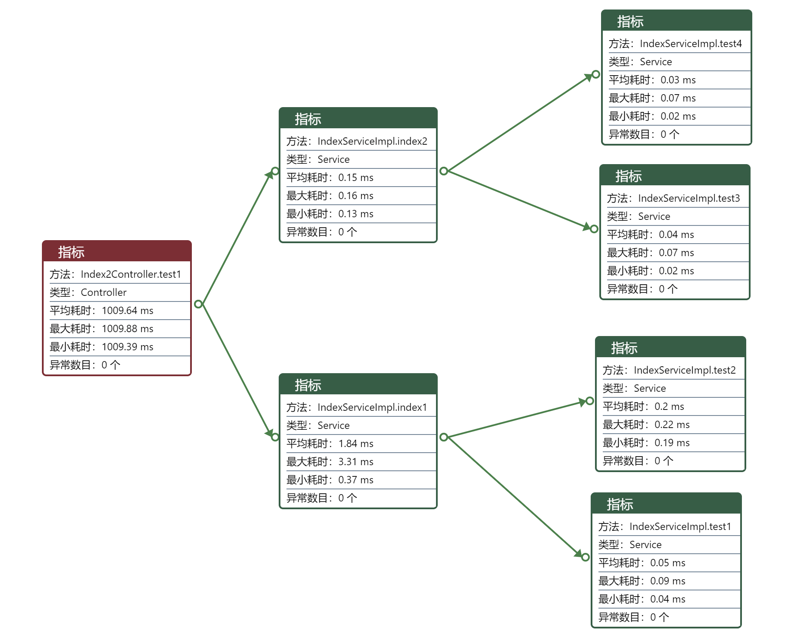
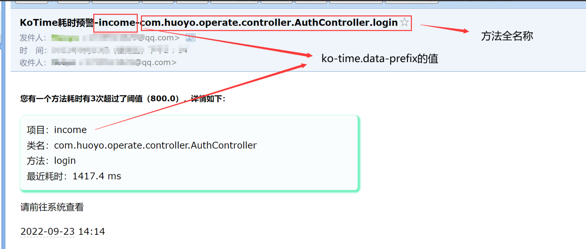

    <h1 >KoTime</h1> 

    
    
    
    <h4>A springboot tool for tracking the paths of methods,which can help you find method's performances easily.</h4>
    <ul>
        <li>Tracking the Java methods and calculating their execution times</li>
        <li>Show the paths of methods</li>
        <li>Find exceptions occurred in methods</li>
        <li>Email you after finding an overtime method</li>
        <li>Hot update online:you needn't restart it</li>
        <li>Easy to use:you needn't additional learning costs</li>
        <li>Enough to add a pom dependency:you needn't additional deployment costs</li>
    </ul>

## Locations

[Gitee](https://gitee.com/huoyo/ko-time.git)

[Github](https://github.com/huoyo/ko-time.git)

[Support](https://www.patreon.com/chongyang)

## Documents

[中文简介/CHINESE](README.md)

[documents](http://kotimedoc.langpy.cn/)

## Display

1.Calculating the execution times of Java methods

Finding the methods that need optimize

2. Interface methods can be seen as follows

You can see every interface method that was called, and you need optimize them when they are red

3.Calling details

After clicking a inteface method,you can find paths of the method

4.Email

You can open email to receive a warning about overtime method since v2.2.5

## Important Versions

> V1.0：Basic functions

> V1.2：Error version

> V1.3：Log and time threshold

> V1.4：Add koTime.pointcut

> V1.8：Add the support for Mybatis and some metrics

> V1.9：--

> V2.0.0：Add the support for exceptions and data interfaces

> V2.0.1：Remove freemarker and thymeleaf;
          Remove 'spring.profiles.active=koTime';
          Remove getAllStackTraces();
          Remove layui;
          Optimize configs；

> V2.0.2：Add auth;

> V2.0.7：Display routes for Controllers

> V2.0.8：Times for various params combinations

> V2.2.0：Support using database to store data

> V2.2.2：Support the viewer to use English

> V2.2.3：Support using redis to store data

> V2.2.5：Add `ko-time.discard-rate` to allow project discard some data;
    Fix a bug for DataBase;
    Add email;

> V2.2.8：Hot update
> 
> V2.3.0：Add `ko-time.auth-expire` to allow users define timeout value;optimize ui
> 
> V2.3.1：Remove StringStack to adapt jdk17+

## Copyright

> 1.This project belongs to Chang Zhang,and Its open source protocol is LGPL-2.1；
>
> 2.You can use it freely by linking it but you can not do secondary development based on this before auhtor's authorization.;
>

