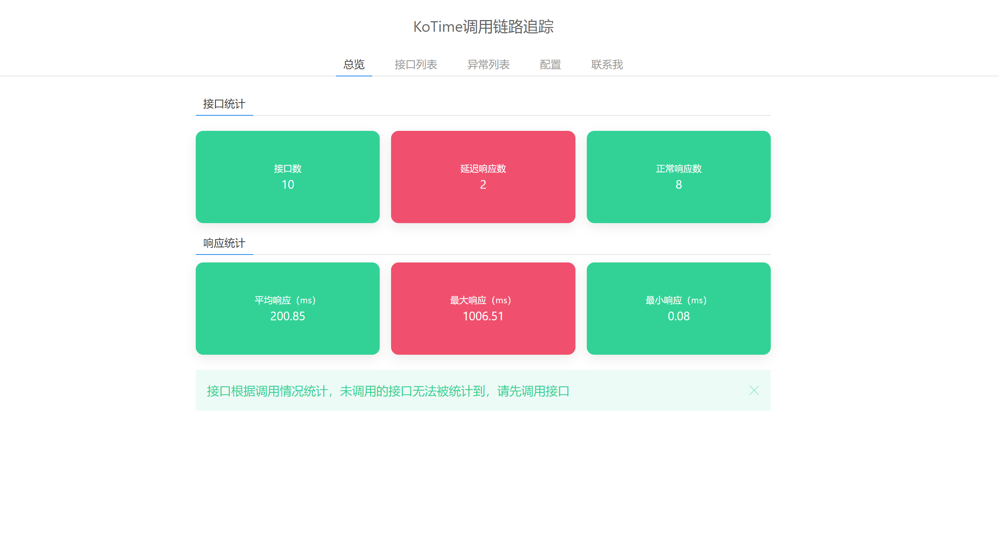
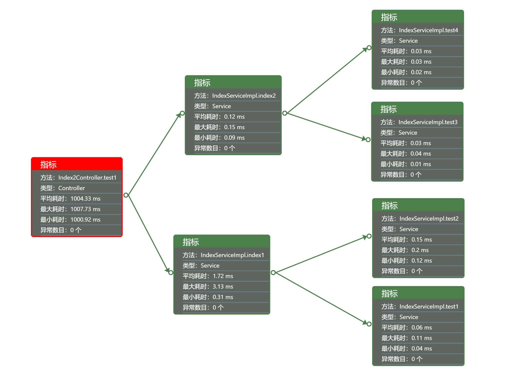

# KoTime

[中文简介/CHINESE](README.md)

    
    
    
    <h4>A springboot tool for tracking the paths of the methods,which can help you to find methods's performances easily.</h4>

## Documents

http://huoyo.gitee.io/ko-time

Features：

> * tracking the Java methods and calculating execution time
> * show the paths of the methods

## Display

1.calculating the execution times of Java methods

finding the methods that need optimize

2. interface methods can be seen as follows

you can see every interface method that were called, and you need optimize them when they are red

3.calling details
after clicking the inteface method,you can find paths of the methods

## Versions

> V1.0：Basic functions

> V1.1：The statistics of methods

> V1.2：Error version

> V1.3：Log and time threshold

> V1.4：Add koTime.pointcut

> V1.5：Remove lombok

> V1.6：Add thymeleaf

> V1.7：Fix 'No value present'

> V1.8：Add the support for Mybatis and some metrics

> V1.9：--

> V2.0.0：Add the support for exceptions and data interfaces

> V2.0.1：Remove freemarker and thymeleaf;
          Remove 'spring.profiles.active=koTime';
          Remove getAllStackTraces();
          Remove layui;
          Optimize configs；

> V2.0.2：Add auth;

> V2.0.3：Optimize pages；

> V2.0.4：Searching methods；

## Copyright

> 1.This project belongs to Chang Zhang,and Its open source protocol is Apache-2.0；
>
> 2.You can use it freely  but please respect copyright;
>
> 3.Please specify the differences if you update codes；
>

