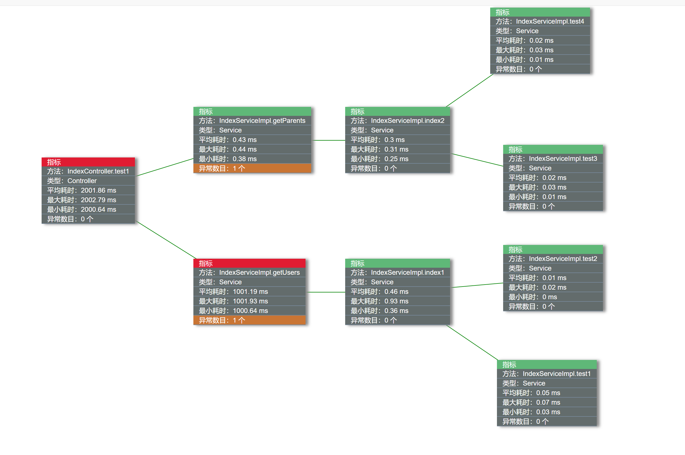

# koTime

> `V2.0.0` 添加异常监测，开放数据接口，修复与swagger冲突bug，添加配置动态更新功能以及重构数据存储机制

#### 介绍
koTime是一个springboot项目性能分析工具，通过追踪方法调用链路以及对应的运行时长快速定位性能瓶颈：

## 文档

http://huoyo.gitee.io/ko-time

优点：
> * 实时监听方法，统计运行时长
> * web展示方法调用链路，瓶颈可视化追踪

缺点：
> * 由于对项目中每个方法进行监控，在性能层面会有一点影响，建议在开发阶段使用，系统稳定后关闭

#### 可视化展示

1.接口调用统计

根据颜色判断需要优化的接口数，红色为待优化，绿色为正常

2.接口列表总览

在列表中会显示该接口的运行耗时，如果为绿色则无需优化，如果为红色，需要详细查看问题所在

3.调用详情

点开接口时，会显示该接口的调用链路以及运行时长

#### 版本说明

> V1.0：基本功能

> V1.1：接口统计

> V1.2：不可用，错误版本

> V1.3：添加日志、时间阈值可配置

> V1.4：添加koTime.pointcut配置

> V1.5：剔除lombok

> V1.6：兼容thymeleaf

> V1.7：修复未调用接口时No value present异常

> V1.8：支持Mybatis的Mapper监测、新增最大/最小运行时间、修复小数位数过长页面边界溢出的bug

> V1.9：过度版本

> V2.0.0：添加异常监测，开放数据接口，修复与swagger冲突bug，添加配置动态更新功能以及重构数据存储机制

> V2.0.1：移除freemarker与thymeleaf；移除`spring.profiles.active=koTime`配置；优化方法链路获取机制(移除getAllStackTraces())

#### 特别说明

1.本项目使用java8开发，其他版本未曾试验，如有什么bug还请告知！

