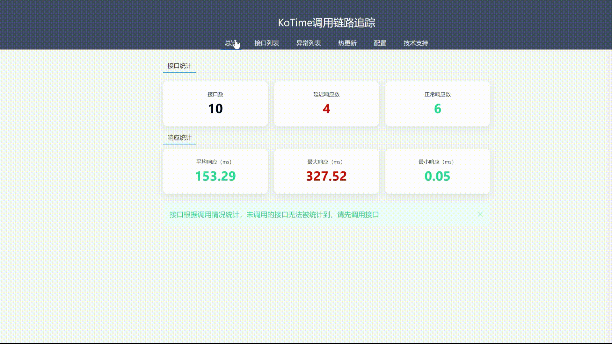
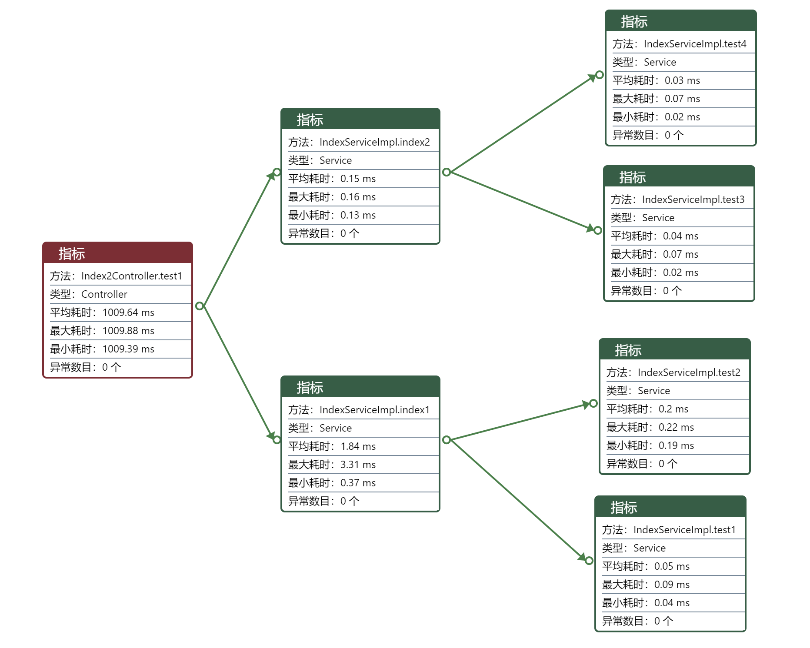
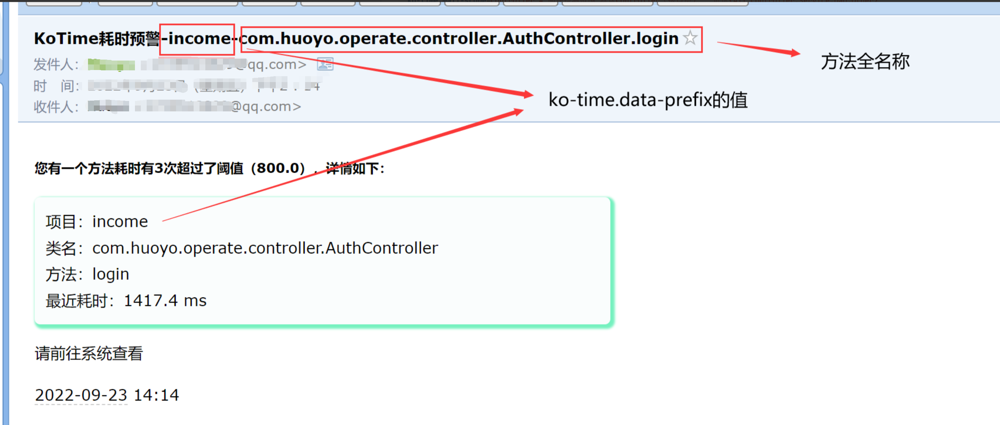

    <h1 >KoTime</h1> 

    
    
    

<h4>A springboot tool for tracing call graph ,which can help you find method's performances easily.</h4>

- [x] Tracking the Java methods and calculating their execution times
- [x] Show the paths of methods
- [x] Find exceptions occurred in methods
- [x] Email you after finding an overtime method
- [x] Hot update online:you needn't restart it
- [x] Easy to use:you needn't additional learning costs
- [x] Enough to add a pom dependency:you needn't additional deployment costs

---

<h4>koTime是一个springboot项目性能分析工具，通过追踪方法调用链路以及对应的运行时长快速定位性能瓶颈</h4>

- [x] 实时监听方法，统计运行时长
- [x] web展示方法调用链路，瓶颈可视化追踪
- [x] 追踪系统异常，精确定位到方法
- [x] 接口超时邮件通知，无需实时查看
- [x] 线上热更新：无需重启更新代码
- [x] 使用简单，无技术学习成本
- [x] pom依赖即可，无代码侵入，无多余部署成本

> 无学习成本直接使用，让软件工程师的卓越思维和宝贵时间用于创造

## 开源地址

[Gitee](https://gitee.com/huoyo/ko-time.git)

[Github](https://github.com/huoyo/ko-time.git)

## 文档

[英文简介/ENGLISH](README-EN.md)

[使用教程](http://kotimedoc.langpy.cn/?source=git)

## 可视化展示

1.接口调用统计

根据颜色判断需要优化的接口数，红色为待优化，绿色为正常

> 

2.接口列表总览

在列表中会显示该接口的运行耗时，如果为绿色则无需优化，如果为红色，需要详细查看问题所在

3.调用详情

点开接口时，会显示该接口的调用链路以及运行时长，红色节点即为需要优化的节点

4.邮件预警

v2.2.5开始加入了邮件通知功能，当方法耗时超过阈值之后，可以选择进行邮件通知

## 重要版本说明

> V1.0：基本功能

> V1.1：接口统计

> V1.2：不可用，错误版本

> V1.3：添加日志、时间阈值可配置

> V1.4：添加koTime.pointcut配置

> V1.8：支持Mybatis的Mapper监测、新增最大/最小运行时间、修复小数位数过长页面边界溢出的bug

> V2.0.0：添加异常监测，开放数据接口，修复与swagger冲突bug，添加配置动态更新功能以及重构数据存储机制

> V2.0.1：移除freemarker与thymeleaf；
         移除spring.profiles.active=koTime配置；
         优化方法链路获取机制(移除getAllStackTraces())；
         替换layui；
         优化配置方式；
         优化页面显示

> V2.0.2：新增登录认证；
          优化页面加载；
          修复方法循环调用栈溢出的bug

> V2.0.7：Controller层显示路由

> V2.0.8：入参组合分析

> V2.2.0：添加数据库存储支持

> V2.2.2：添加英文支持

> V2.2.3：添加redis存储支持

> V2.2.5：添加ko-time.discard-rate配置，允许丢弃一部分数据提高性能；
            修复数据库查询超时的bug;
            添加邮件通知功能;

> V2.2.8：热更新
> 
> V2.3.0：添加 `ko-time.auth-expire`，允许用户自定义登录超时时间;优化ui页面
>
> V2.3.1：移除 StringStack 以适配jdk17+

## 项目起因

曾经一个项目出现了部分功能响应时间过长的情况，
作为一名开发（che）多年的老司机，显然是打开浏览器看看是哪个接口作妖，
然后顺着网线找到Controller层，找到Service层，找到dao层...

一层的一层的看， 一圈一圈的调试，一个方法一个方法的加入时间统计...

一个上午的时间下来， 也就是找出了一个需要我5分钟改掉的问题， 而大部分的时间却浪费在了定位问题上，这是我所不能接受的

于是乎，常年面向网络编程的我决定上网找找有没有方法调用链路追踪框架，帮我记录每个接口的调用情况，以及每个方法的运行时长，这样可以快速定位到问题所在，省下我一个或者多个一早上定位问题的时间，毕竟，时间是用来解决问题的，而不是用来发现问题的，而这个问题往往是自己写下的愚蠢代码导致的！
出乎意料的是，竟然没有找到一个对应开源框架可以直接使用（也有可能是我的搜索水平有待提高，当然我是不会承认的！）

对于我这个小项目来说需要，要求也就以下几点：

> 接口层或者方法为主切入，清晰明了
> 
> 简单易用，无需多余维护成本
>
> 链路可视化展示，无多余堆栈信息（我只关心我写的代码，多余堆栈信息视觉体验超差）
> 

为什么不用Skywalking、Pinpoint和Arthas之类的产品？

Skywalking是个优秀的分布式应用性能监控工具（向吴大神致敬），更多关注分布式之间的问题，对于项目本身的粒度不是那么关注，另外就是它的颜值...

而Pinpoint，作为颜控的我一直是很喜欢的，但是它对于调用链路的UI设计，满屏的代码密集让我已经找不到我的方法在哪里了（主观感受，不喜勿喷）

至于Arthas，可以算是一个丰富且实用的百宝箱了，你可以在需要的时候取出命令来实现程序的各种诊断，但终归是即用即动手（其实我不想每次都动手），输出无妆容

而且对于很多中小型企业来说，就是一个单体项目，并不需要多余的运维和部署成本!

所以就有了这个简单的小项目，喜欢的可以给个Star，十分感谢！

## 特别说明

1.本项目使用java8开发，其他版本未曾试验，如有什么bug还请告知！

## 版权说明

> 1.本项目版权属作者所有，并使用 LGPL-2.1进行开源；
>
> 2.您可以使用本项目进行学习，并且免费将本项目作为第三方库引入后闭源或者商用；
>
> 3.但不允许将本项目二次开发后后商用（除非得到作者授权）；
> 
> 4.以上所述内容仅仅是开源版本，不包含专业版本，专业版本需联系作者授权使用

> 简单理解：开源项目直接使用永远是免费的，这一点不会变，但是不允许二次开发以后进行商用

## 优秀的贡献者

[点击查看详情](CONTRIBUTORS.md)

