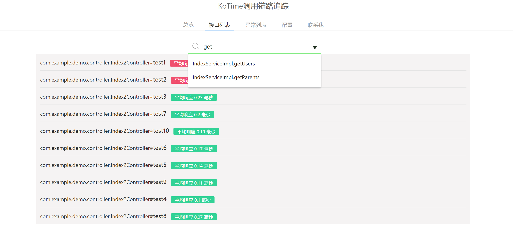
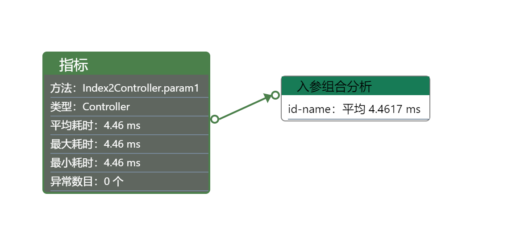
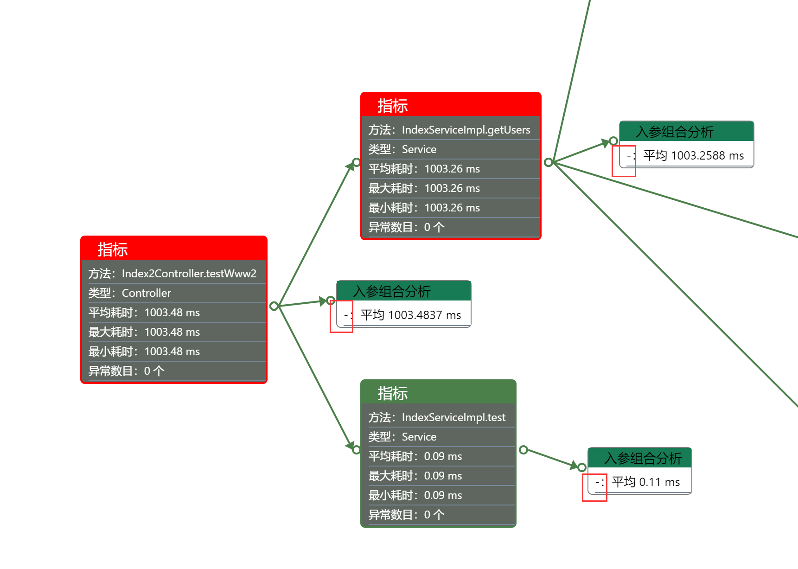

## 首页面板

首页有六个统计指标，分别是

`总接口数`、`延迟响应接口数`、`正常响应接口数`、`平均响应`、`最大响应`、`最小响应`

接口是否延迟取决于`ko-time.threshold`的配置，大于该阈值即表示延迟，显示为红色，如下图

## 接口列表

该列表展示的是监测到被请求过的接口，按照其平均响应时间倒序排列，超过`ko-time.threshold`的接口显示红色，如下图：

可根据类名或者方法名模糊搜索，回车即可

点击每一个接口后会显示该接口的方法调用链路、各个方法的运行时间以及该方法是否发生了异常，方法节点可拖动

双击节点，可以查看不同入参组合下的调用时间分析（再双击即可收起）：

**-** 表示无参数

## 异常列表

异常列表以异常为切入点，并显示每个异常发生的位置

## 配置面板

配置面板有四项配置，可在不重启系统的情况下进行配置

`开启koTime监测` ：该开关对应`ko-time.enable`，默认开启，当不需要koTime时可选择关闭

`开启异常监测` ：该开关对应`ko-time.exception-enable`，默认关闭，当需要时可选择开启

`开启控制台日志` ：该开关对应`ko-time.log-enable`，默认关闭，当需要时可选择开启，即可在控制台打印日志

`方法运行时间阈值` ：该开关对应`ko-time.threshold`，默认800ms，可调整，调整后接口列表和方法节点的颜色将以新的阈值变化

