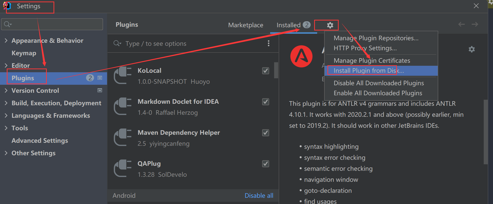
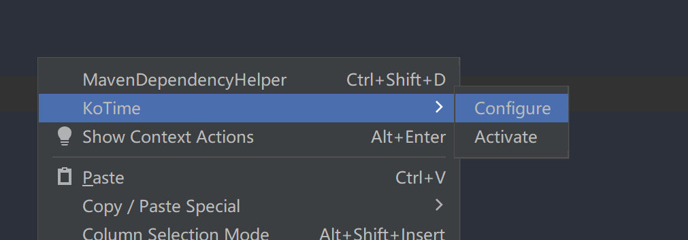
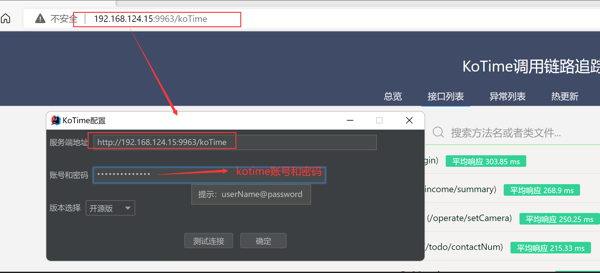
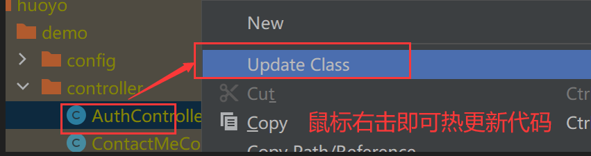
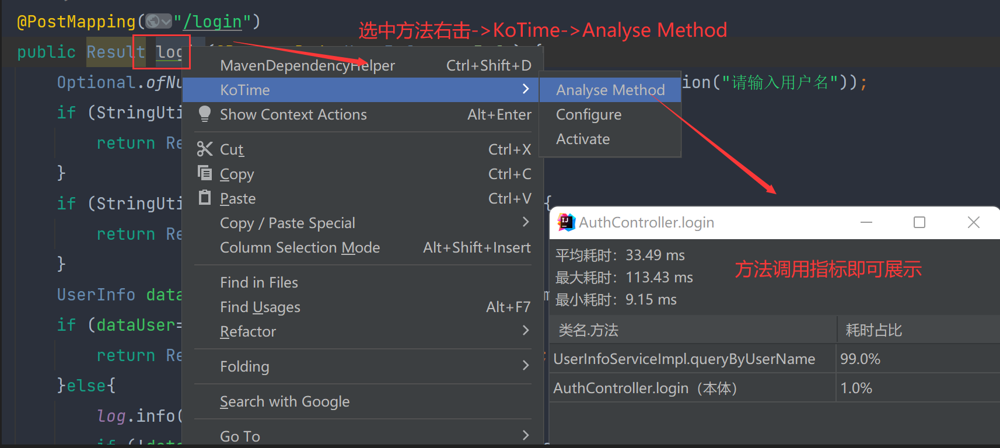
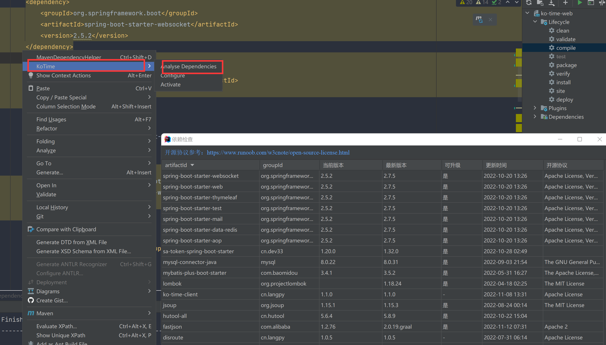

## 简介

KoLocal是针对KoTime开发的一款本地化插件，旨在便捷的使用KoTime的热更新、方法分析和依赖检查等功能，
而不用打开浏览器页面操作，不过该插件有点贵，毕竟需要1块钱！

### 安装

> 如有使用问题，可以在首页找到联系方式进行咨询或者提交留言

* 首页订阅下载后进行解压，得到jar包
* [插件下载](http://www.kotime.cn/person)
* 然后File->Setting->plugin->设置图标->install from disk

* 安装完后以后到首页->登录->个人中心获取激活码（未订阅的可以试用）
* 打开任意代码界面右击找到Activate按钮进行激活
  

* 然后打开Configure界面进行认证，本地调试的配置为本地地址，线上的配置为线上地址

  

* 完成

### 代码热更新

> 注意：该功能基于 jvm attach api 不支持在类中新增方法或者属性后进行热更新，仅支持方法内部的代码更改

* 修改代码后->maven compile
* 找到target/classes目录下编译的好的class文件
* 右击->Update Class即可更新成功

### 方法分析

* 任意打开要分析的java代码文件
* 选中方法名称->右击

### 依赖版本和开源协议检查

* 打开pom.xml
* 在文件内右击->KoTime->Analyse Dependencies

> 第一次检查需要同步版本信息，需要等一会儿，另外请确保idea环境能连接网络（http://www.kotime.cn/）
> 不同的开源项目有不同的要求，使用需谨慎

---

