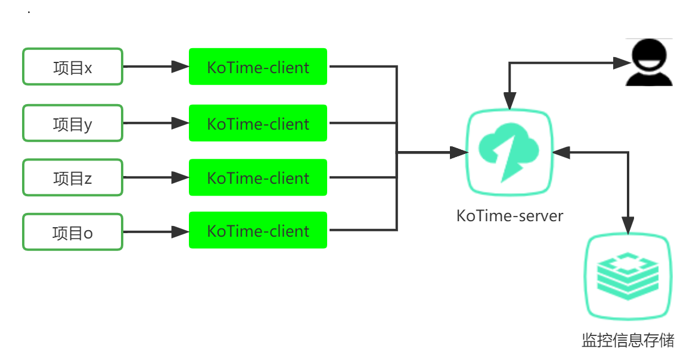
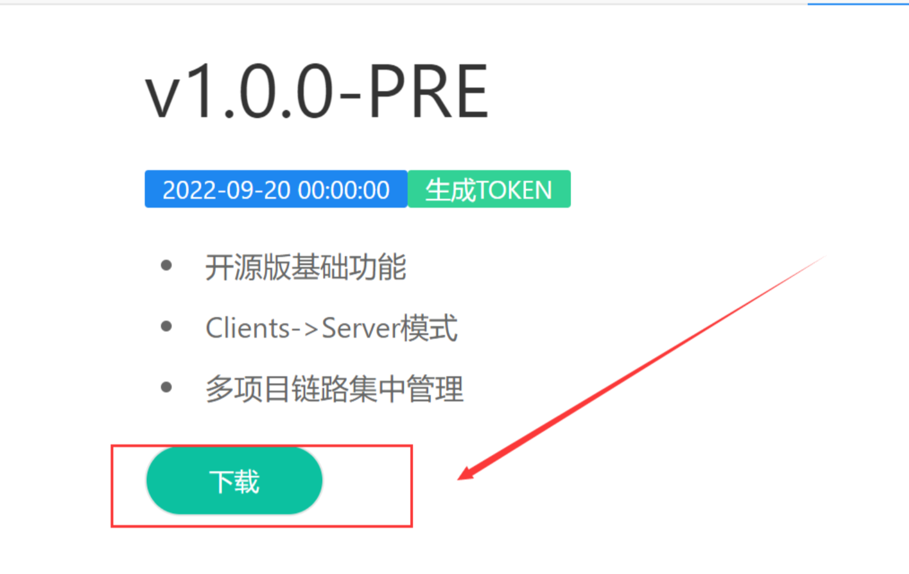
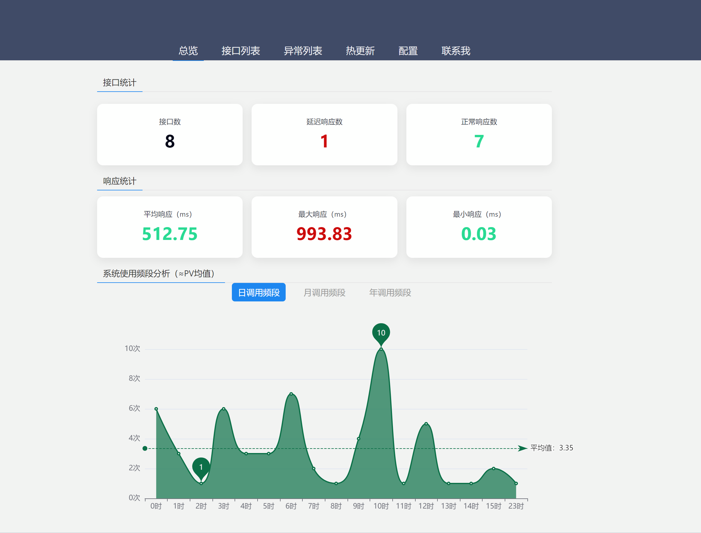
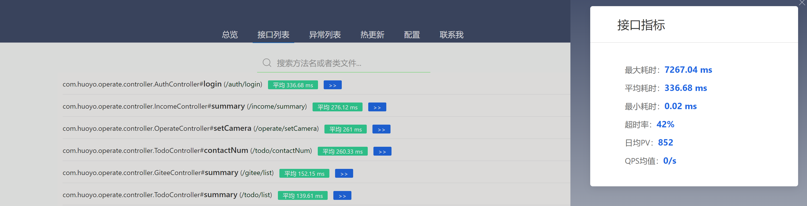
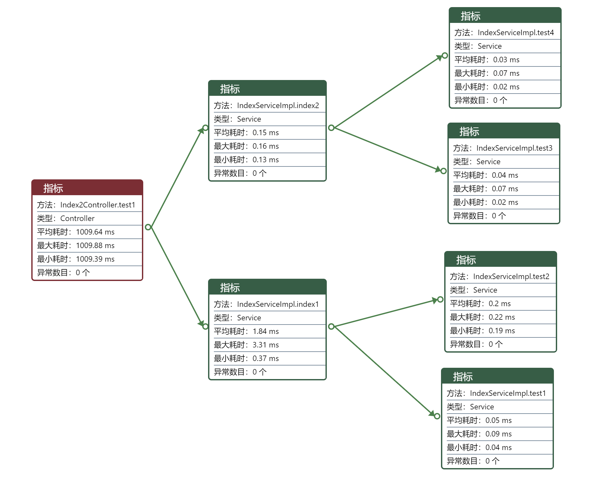
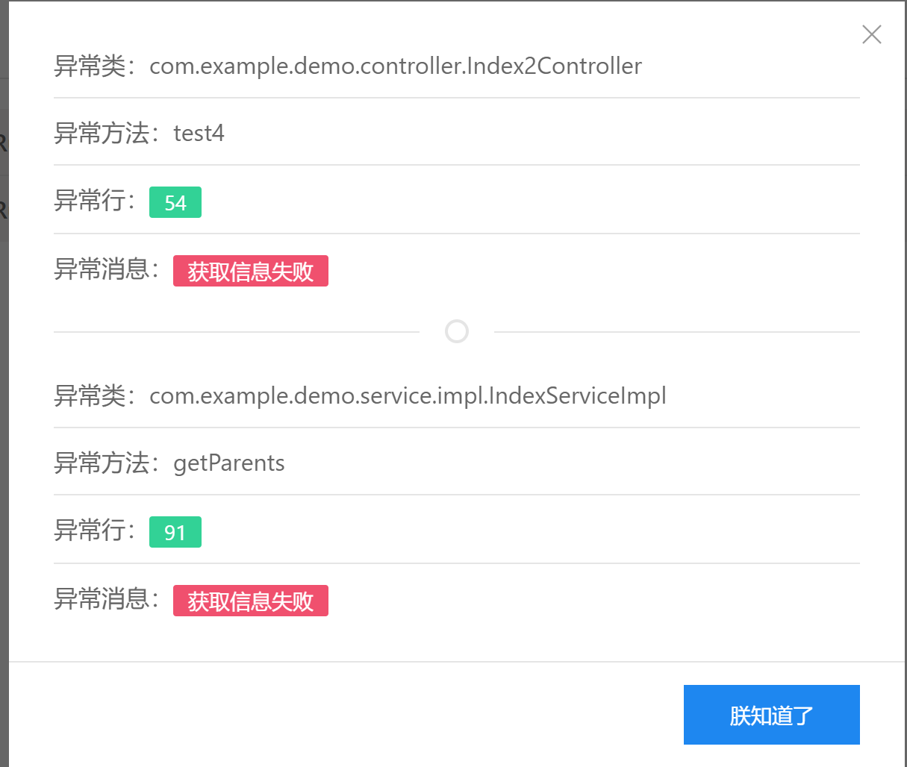
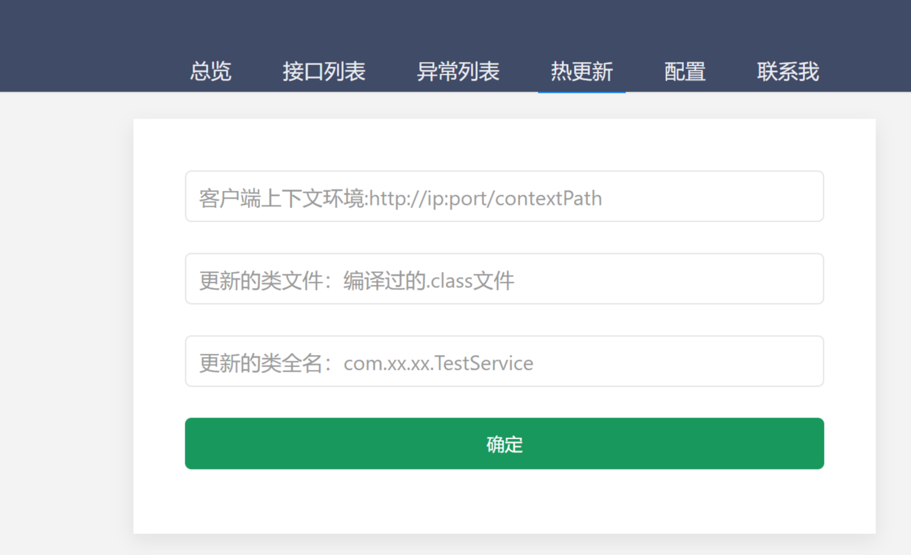
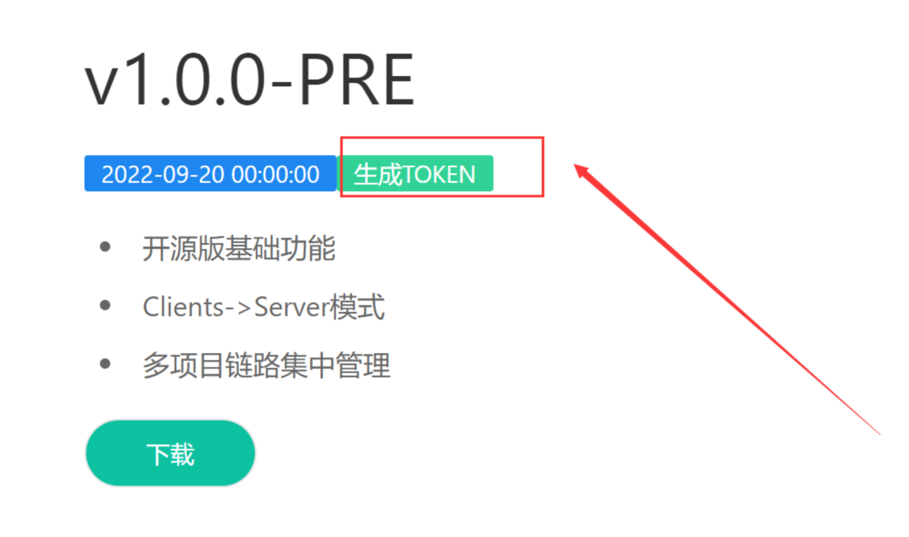

## 简介

> 专业版的功能主要基础开源版本，并做差异化开发，部分功能未同步会在一周之内进行同步

> 如有使用问题，可以在首页找到联系方式进行咨询或者提交留言

KoTime Pro主要分为两部分：Client和Server,如下图：



> client作为数据采集端，在项目中以pom依赖的方式引入即可，可以对多个项目进行采集，集成后调用接口，Server端即可看到数据
> 
> server作为服务端，承担数据的计算和用户交互功能，单独部署即可


## Server部署

### 1.下载

订阅以后进入**个人中心**，选择一个v1.1.0下载，也可以[试用](http://kotimedoc.langpy.cn/trialpro)




### 2.配置

将压缩包解压后得到两个文件：
> ko-time-server-1.1.0.jar和application.properties

使用文本编辑工具修改application.properties

```properties
#web服务端口
server.port=9905

#kotime配置
#是否开启web认证
ko-time.auth-enable=true
#web服务：用户名
ko-time.user-name=xxx
#web服务：密码
ko-time.password=xxx
#数据存储方式（database和redis，推荐使用database,数据量偏大时，redis的分析劣势就会显现）
ko-time.saver=database
#存储数据的核心线程数
ko-time.thread-num=10
#从客户端获取数据的端口
ko-time.data-port=9906
#数据丢弃率
ko-time.discard-rate=0.3
#默认超时阈值 ms
ko-time.threshold=800.0

#数据库存储地址（ko-time.saver=database时需要配置）
spring.datasource.url=jdbc:mysql://ip:port/database_name?&autoReconnect=true
spring.datasource.username=xxx
spring.datasource.password=xxx

#redis存储地址（ko-time.saver=redis时需要配置）
spring.redis.host=xxx.xxx.xxx.xxx
spring.redis.password=xxx

#邮件通知配置
#开启邮件通知 不需要的话false即可
ko-time.mail-enable=true
#邮件协议
ko-time.mail-protocol=smtp
# 邮件服务器 默认smtp.qq.com（QQ邮件）
ko-time.mail-host=smtp.qq.com
#邮件服务器 默认587（QQ邮件端口）
ko-time.mail-port=587
#编码
ko-time.mail-encoding=UTF-8
#邮件检测范围 默认Controller（接口层可选{All,Controller,Service,Dao,Other}
ko-time.mail-scope=Controller
#邮件触发阈值 默认4 耗时n次超过阈值即发送邮件
ko-time.mail-threshold=4
# 设置发送者 可以设置为你的QQ邮箱 必填
ko-time.mail-user=xxxx@qq.com
# 邮箱授权码 请到QQ邮箱申请 必填
ko-time.mail-code=xxxxx
# 邮件接收者 多个请用英文逗号隔开 必填
ko-time.mail-receivers=xxxx@qq.com


```

如果ko-time.saver=database需要在mysql中建表：
```sql
create table ko_method_node
(
  id          varchar(400) not null primary key comment '主键',
  name        varchar(400) null comment '类名+方法名',
  class_name  varchar(400) null comment '类名',
  method_name varchar(400) null comment '方法名',
  route_name  varchar(400) null comment '路由，controller才有',
  method_type varchar(64) null comment '方法类型',
  data_source varchar(100) null comment '数据来源'
) comment '方法信息表';


create table ko_method_relation
(
  id           varchar(400) not null primary key comment '',
  source_id    varchar(400) null comment '调用方id',
  target_id    varchar(400) null comment '被调用方id',
  avg_run_time numeric(10, 2) null comment '平均耗时',
  max_run_time numeric(10, 2) null comment '最大耗时',
  min_run_time numeric(10, 2) null comment '最小耗时',
  data_source varchar(100) null comment '数据来源'
) comment '方法调用关系表';
;
create table ko_exception_node
(
  id         varchar(400) not null primary key comment '主键',
  name       varchar(400) null comment '异常名',
  class_name varchar(400) null comment '类名',
  data_source varchar(100) null comment '数据来源'
) comment '异常表';


create table ko_exception_relation
(
  id        varchar(400) not null primary key comment '',
  source_id varchar(400) null comment '调用方法id',
  target_id varchar(400) null comment '异常id',
  message    text null comment '异常消息',
  location  int null comment '异常位置',
  data_source varchar(100) null comment '数据来源'
) comment '异常关系表';

create table ko_param_ana
(
  source_id    varchar(400) null comment '调用方法id',
  params       varchar(400) null comment '参数组合，-分隔',
  avg_run_time numeric(10, 2) null comment '平均耗时',
  max_run_time numeric(10, 2) null comment '最大耗时',
  min_run_time numeric(10, 2) null comment '最小耗时',
  data_source varchar(100) null comment '数据来源'
) comment '参数分析表';

create table ko_interface_info
(
    id           varchar(400)  not null primary key,
    source_id         varchar(400)  not null comment '调用方法id',
    stat_year   varchar(6)   null comment '统计时间',
    stat_month   varchar(4)   null comment '统计时间',
    stat_day   varchar(4)   null comment '统计时间',
    stat_hour   varchar(4)   null comment '统计时间',
    data_source   varchar(100) null comment '数据来源',
    timeout_num    int    null comment '超时次数',
    call_num    int       null comment '调用次数'
) comment '接口信息表';
create index interface_info_source_id on ko_interface_info(source_id);
create index interface_info_data_source on ko_interface_info(data_source);

create table ko_cpu_info
(
    system_load  numeric(10, 2) null comment '系统负载',
    user_rate    numeric(10, 2) null comment '用户使用率',
    sys_rate     numeric(10, 2) null comment '系统使用率',
    wait_rate    numeric(10, 2) null comment 'IO等待率',
    logical_num  int            null comment '逻辑核心数',
    stat_time   varchar(10)    null comment '统计时间',
    data_source varchar(100)   null comment '数据来源客户端'
) comment 'cpu使用情况表';

create table ko_heap_memory_info
(
    init_value  long null comment '初始值',
    max_value    long null comment '最大值',
    used_value     long null comment '已用值',
    used_rate    numeric(10, 2) null comment '使用率',
    stat_time   varchar(10)    null comment '统计时间',
    data_source varchar(100)   null comment '数据来源客户端'
) comment '堆内存使用情况表（单位 byte）';

create table ko_physical_memory_info
(
    init_value  long null comment '初始值',
    free_value    long null comment '最大值',
    used_value     long null comment '已用值',
    this_used_value     long null comment '当前客户端使用的内存',
    this_used_rate     numeric(10, 2) null comment '当前客户端的物理内存占用率',
    this_used_peak     long null comment '当前客户端使用的内存峰值',
    used_rate    numeric(10, 2) null comment '使用率',
    stat_time   varchar(10)    null comment '统计时间',
    data_source varchar(100)   null comment '数据来源客户端'
) comment '物理内存使用情况表（单位 byte）';
```
### 3.部署
配置完成后，将ko-time-server-1.1.0.jar和application.properties放到同一个文件夹下，进行启动即可
> java -jar ko-time-server-1.1.0.jar

然后打开浏览器进行访问：
> http://部署地址:web服务端口/koTime


### 4.页面使用
#### 1.选择项目
打开浏览器访问以后，在左上角选择对应的项目即可看到相关信息

#### 2.总览
首页有六个统计指标，分别是

`总接口数`、`延迟响应接口数`、`正常响应接口数`、`平均响应`、`最大响应`、`最小响应`

接口是否延迟取决于`ko-time.threshold`的配置，大于该阈值即表示延迟，显示为红色



#### 3.接口列表
该列表展示的是监测到被请求过的接口，按照其平均响应时间倒序排列，超过**`**ko-time.threshold**`**的接口显示红色，如下图：

可根据类名或者方法名模糊搜索，回车即可



#### 4.调用链路

点击每一个接口后会显示该接口的方法调用链路、各个方法的运行时间以及该方法是否发生了异常（有异常的会多一个异常个数的指标），方法节点可拖动



#### 5.入参组合

双击节点，可以查看不同入参组合下的调用时间分析（再双击即可收起）：

-表示无参数
#### 6.异常列表

异常列表以异常为切入点，并显示每个异常发生的位置



#### 7.热更新
> **1.左上角选择要更新的项目**
> **2.确认要更新的项目的路径是否正确：http://ip:port/context-path**
> 3.**更改代码->maven clean->maven compile**
> **4.选择target/classes目录下需要更新的类->填写类名->提交**

> **注意：确保Client权限中放开/koTime/**；确认Server与Client（http://ip:port/context-path）网络通常**



## Client集成


### 1.引入依赖

在pom.xml中添加

```properties
<dependency>
      <groupId>cn.langpy</groupId>
      <artifactId>ko-time-client</artifactId>
      <version>1.1.0</version>
</dependency>
```
### 2.配置
在项目的application.properties中配置
```properties
# 是否开启koTime，默认开启，当为false时，关闭koTime  
ko-time.enable=true
# 配置你自己的切面路径 参考aop
ko-time.pointcut: execution(* com.huoyo..*(..))
# 是否开启控制输出，默认false  
ko-time.log-enable=false
# 是否开启异常检测，默认为false,开启后会对方法内部抛出的异常进行统计
ko-time.exception-enable=true
# 调用信息发送Server的线程数（为了不影响项目本身性能，链路存储异步进行），默认2，该值并非越大越好
ko-time.thread-num=2
# 项目标识，在Server端选择的时候根据该标识查看对应的项目
ko-time.data-prefix=test
# Server的部署ip
ko-time.data-host=localhost
# Server的部署数据端口
ko-time.data-port=9906
# 与服务端通信的认证标识，该标识包含了订阅账号和服务到期时间，过期后无法使用，请到个人中心申请
ko-time.data-token=xxxxxxxxxxxxxxxxxx
```
### 3.申请data-token
点击对应的版本即可生成



## 其他说明

1. Server与Client的部署顺序无需关心
2. 项目启动后，Client会尝试与Server连接，未连接则不发送数据，不会影响项目
3. Client与Sever的通信过程完全异步，Client获取调用信息后异步发送给Server，将链路的计算压力过渡到Server端
4. 随着版本的迭代，功能会越来越多，我们会将最新的版本和功能推送到您的账号，在订阅期内都可以使用新版本
